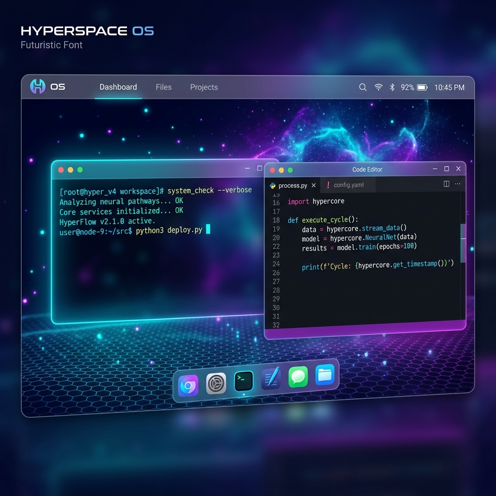

# 🚀 HyperSpace OS v2.0



> **Experience the future of the web.** HyperSpace OS is a high-performance, aesthetically premium, web-based operating system built with Vanilla JavaScript and Canvas.

## ✨ Overview

HyperSpace OS is more than just a website; it's a fully functional desktop environment running entirely in your browser. Designed with a focus on **Glassmorphism**, **Fluidity**, and **Power**, it brings a simulated OS experience to the web with a virtual file system, multi-window management, and a suite of built-in applications.

---

## 🌟 Key Features

### 🖥️ Advanced Window Management
- **Multi-Window Interface**: Open, drag, resize, and stack multiple applications.
- **Glassmorphism UI**: High-end visual aesthetic with real-time blur, frosted glass effects, and sleek animations.
- **Workspaces**: Organise your workflow across multiple virtual desktops.
- **Spotlight Search**: Quick-launch apps and search files with `Alt + Space`.

### 📂 Virtual File System (VFS)
- **Persistent Storage**: Real CRUD operations persisted via LocalStorage.
- **Unix-like Structure**: Root `/`, `home`, `usr`, `etc` directories.
- **File Interop**: Open files from the terminal or file manager directly into the code editor.

### 🎨 Visual Excellence
- **Three.js Background**: Dynamic, GPU-accelerated particle backgrounds and grids.
- **Theme Engine**: System-wide theme switching with accent color customization.
- **Smooth Animations**: 60 FPS transitions and micro-interactions powered by custom CSS and JS.

### 🛠️ Built-in Application Suite
- **Terminal**: A powerful shell with 27+ Unix-like commands (`ls`, `cd`, `mkdir`, `top`, `neofetch`, etc.).
- **Editor**: A full-featured code editor powered by **CodeMirror 6**.
- **Files**: Interactive file explorer with grid/list views and context menus.
- **Task Manager**: Monitor system performance, FPS, and manage running processes.
- **AI Assistant**: Integrated AI capabilities for coding help and system tasks.
- **Whiteboard**: Collaborative-ready drawing canvas with multiple tools.
- **Music Player**: Minimalist audio player with playlist support.
- **System Monitor**: Real-time hardware simulation and data visualization via **uPlot**.

---

## 🚀 Getting Started

### Prerequisites
- [Node.js](https://nodejs.org/) (v18+ recommended)
- [Vite](https://vitejs.dev/)

### Installation

1. Clone the repository:
   ```bash
   git clone https://github.com/yourusername/hyperspace-os.git
   cd hyperspace-os
   ```

2. Install dependencies:
   ```bash
   npm install
   ```

3. Start the development server:
   ```bash
   npm run dev
   ```

4. Open your browser and navigate to `http://localhost:5173`.

---

## 🛠️ Technology Stack

- **Core**: Vanilla JavaScript (ES6+ Modules)
- **UI Architecture**: Custom-built Window Manager & UI Kit
- **Styling**: Modern CSS (Variables, Grid, Flexbox, Backdrop-filter)
- **Graphics**: [Three.js](https://threejs.org/) (Backgrounds), HTML5 Canvas
- **Editor**: [CodeMirror 6](https://codemirror.net/)
- **Charts**: [uPlot](https://github.com/leeoniya/uPlot)
- **Markdown**: [Marked](https://marked.js.org/)
- **Build Tool**: [Vite](https://vitejs.dev/)

---

## ⌨️ Terminal Commands

The HyperSpace Terminal supports a wide range of commands:

| Command | Description |
| :--- | :--- |
| `ls` / `ll` | List directory contents |
| `cd` | Change current directory |
| `cat` | View file contents |
| `edit` | Open file in the Code Editor |
| `top` | Open Task Manager |
| `neofetch` | Display system information |
| `clear` | Clear the terminal screen |
| `help` | List all available commands |

---

## 📁 Project Structure

```text
HyperspaceOS/
├── src/
│   ├── apps/       # Built-in applications
│   ├── canvas/     # Three.js & Canvas rendering
│   ├── core/       # OS kernel, FileSystem, EventBus
│   ├── ui/         # Shell components (Dock, Statusbar)
│   ├── wm/         # Window Manager logic
│   └── main.js     # Entry point
├── public/         # Static assets
└── index.html      # Main HTML entry
```

---

## 📄 License

This project is licensed under the MIT License - see the [LICENSE](LICENSE) file for details.

---

<p align="center">
  Built with ❤️ for the future of the web.
</p>
